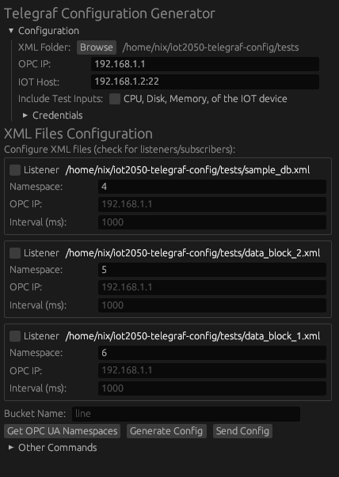

# IoT2050 Monitoring Stack

## Introduction

The IoT2050 Monitoring Stack is a comprehensive Docker-based monitoring solution designed for industrial IoT devices, particularly the SIEMENS SIMATIC IOT2050. It provides automated deployment of a complete monitoring infrastructure including time-series data collection, storage, and visualization.

The stack streamlines the process of setting up industrial monitoring by automating the deployment of InfluxDB, Telegraf, Grafana, and Prometheus in a containerized environment. It features an integrated OPC-UA browser for easy tag selection and configuration generation.



## Key Features

### 🐳 **Docker-Based Monitoring Stack**
- **Complete monitoring solution** with InfluxDB, Telegraf, Grafana, and Prometheus
- **Multi-architecture support** (x86_64 for development, ARM64 for production)
- **Automated deployment** with device provisioning and stack setup
- **Persistent data storage** with Docker volumes

### 🖥️ **Interactive OPC-UA Browser**
- **Real-time node exploration** with hierarchical tree navigation
- **Lazy loading** for efficient browsing of large node trees
- **Visual tag selection** with checkbox interface
- **Configuration integration** directly into monitoring stack

### 💻 **Terminal User Interface (TUI)**
- **Cross-platform terminal interface** for headless environments and SSH sessions
- **Arrow key navigation** with visual selection highlighting
- **Per-file configuration editing** (namespace, IP, interval settings)
- **OPC-UA namespace polling** with timeout and error feedback
- **Anonymous authentication support** for OPC-UA servers
- **Four-tab interface**: Files, OPC-UA Config, IoT Config, Actions

### 🚀 **Automated Deployment**
- **One-command device provisioning** with Docker installation
- **Cross-platform image building** and deployment
- **SSH-based automation** for remote device management
- **Environment configuration** with secure credential generation

### 📊 **Monitoring & Visualization**
- **Pre-configured Grafana dashboards** for system and custom metrics
- **InfluxDB integration** for time-series data storage
- **Prometheus metrics** for additional monitoring capabilities
- **Multi-source data collection** from OPC-UA, system metrics, and Docker

### 🔧 **Legacy Configuration Generation**
- **XML-based templates** for traditional Telegraf configuration
- **Multiple output formats** (InfluxDB v2, Prometheus)
- **Namespace management** for multi-source deployments

## Quick Start

### 1. Provision Your IoT Device

First, provision your target device with Docker and required dependencies:

```bash
cd docker
./scripts/init.sh 192.168.1.100
```

**What this does:**
- Installs Docker and Docker Compose on the device
- Sets up user permissions and system requirements
- Prepares the device for monitoring stack deployment

### 2. Deploy the Monitoring Stack

Build and deploy the complete stack to your provisioned device:

```bash
./scripts/deploy.sh 192.168.1.100
```

**What this does:**
- Builds Docker images locally with ARM64 support
- Transfers images and configuration to the device
- Deploys and starts the monitoring stack
- Reports service URLs and credentials

### 3. Access Your Services

After deployment, access your monitoring services:

- **Grafana**: http://192.168.1.100:3000
- **InfluxDB**: http://192.168.1.100:8086
- **Prometheus**: http://192.168.1.100:9090

Default credentials are automatically generated and displayed after deployment.

### 4. Configure OPC-UA Data Collection (Optional)

Use the GUI to browse and configure OPC-UA data sources:

```bash
./sie_generate_config_gui
```

## Advanced Usage

### Local Development and Testing

Test the monitoring stack locally before deployment:

```bash
cd docker
./scripts/setup.sh      # Generate environment configuration
./scripts/start.sh      # Start the stack locally
```

Services will be available at localhost with the same ports.

### Terminal User Interface (TUI)

For headless environments, SSH sessions, or when you prefer terminal-based interfaces:

```bash
# Launch the TUI
./sie_generate_config_tui
```

**TUI Navigation:**
- **Tab/1-4**: Switch between tabs (Files, OPC-UA Config, IoT Config, Actions)
- **↑/↓**: Navigate fields in config tabs
- **Enter**: Edit selected field or toggle boolean values
- **Space**: Toggle file selections in Files tab
- **Esc**: Cancel editing or exit
- **h/F1**: Show help

**Legacy hotkeys still supported:**
- **i/u/p/a/t**: Edit IP/username/password/anonymous/test inputs in OPC-UA tab
- **h/u/p**: Edit host/username/password in IoT tab

### CLI Deployment Management

Use the CLI for advanced deployment operations:

```bash
# Provision a device
./sie_generate_config deploy provision 192.168.1.100 -u admin -p password

# Deploy monitoring stack
./sie_generate_config deploy setup 192.168.1.100 --build-local

# Check deployment status
./sie_generate_config deploy status 192.168.1.100

# Start/stop services
./sie_generate_config deploy start 192.168.1.100
./sie_generate_config deploy stop 192.168.1.100
```

### Custom Configuration

Customize the monitoring stack by editing configuration files in `docker/config/`:

- **Telegraf**: `docker/config/telegraf/telegraf.conf.example`
- **Grafana**: `docker/config/grafana/provisioning/`
- **Prometheus**: `docker/config/prometheus/prometheus.yml`

### Environment Variables

Configure deployment settings using environment variables:

```bash
# Example .env configuration
INFLUXDB_USER=admin
INFLUXDB_PASSWORD=secure_password
INFLUXDB_ORG=your_org
INFLUXDB_BUCKET=telegraf
GRAFANA_ADMIN_USER=admin
GRAFANA_ADMIN_PASSWORD=secure_password
```

## Legacy Features

### Configuration Generation (Traditional Mode)

For traditional Telegraf configuration generation without Docker:

```bash
# Generate configuration from XML files
./sie_generate_config config -f /path/to/xml/folder

# Use GUI for interactive configuration
./sie_generate_config_gui
```

### Test Tools

```bash
# Start OPC-UA test server
./opcua_test_server

# Test OPC-UA client connection
./opcua_client_test
```

## Architecture

### Monitoring Services

- **InfluxDB 2.x**: Time-series database with built-in web UI
- **Telegraf**: Metrics collection agent with OPC-UA, system, and Docker inputs
- **Grafana**: Visualization platform with pre-configured dashboards
- **Prometheus**: Metrics collection and alerting (optional)

### Deployment Automation

- **init.sh**: Device provisioning and Docker installation
- **deploy.sh**: Complete stack deployment with image building
- **setup.sh**: Environment configuration and credential generation
- **start.sh/stop.sh**: Service lifecycle management

### Data Flow

1. **OPC-UA servers** → Telegraf (OPC-UA input plugin)
2. **System metrics** → Telegraf (system input plugins)
3. **Docker metrics** → Telegraf (Docker input plugin)
4. **Telegraf** → InfluxDB (time-series storage)
5. **InfluxDB** → Grafana (visualization)
6. **Prometheus** → Grafana (alternative metrics path)

## Building from Source

### Development Requirements

- Rust 1.70+
- Docker and Docker Compose
- Cross-compilation support for ARM64 (optional)

### Build Steps

```bash
# Clone the repository
git clone <repository-url>
cd iot2050-telegraf-config

# Build the application
cargo build --release

# Test the Docker stack locally
cd docker
./scripts/setup.sh
./scripts/start.sh
```

### Cross-Platform Building

Enable ARM64 emulation for testing:

```bash
docker run --privileged --rm tonistiigi/binfmt --install all
```

## Troubleshooting

### Common Issues

**Deployment fails on device provisioning:**
- Verify SSH connectivity and credentials
- Ensure device has sufficient disk space (minimum 4GB)
- Check internet connectivity for Docker installation

**Docker services fail to start:**
- Check logs: `docker-compose logs -f`
- Verify port availability (3000, 8086, 9090)
- Ensure sufficient system resources

**OPC-UA connection issues:**
- Verify OPC-UA server accessibility
- Check certificates and authentication
- Test with `./opcua_client_test`

### Getting Help

- Check service logs: `./scripts/stop.sh && ./scripts/start.sh`
- View deployment status: `docker-compose ps`
- Reset everything: `docker-compose down -v && ./scripts/setup.sh`

## Migration from Legacy Deployments

If you're upgrading from manual Telegraf deployments:

1. **Backup existing data** before migration
2. **Use the Docker stack** for all new deployments
3. **Migrate configurations** to the new format
4. **Update monitoring endpoints** to use new service URLs

Manual device deployments are **no longer supported**. Please migrate to the Docker-based stack for better reliability and maintenance.

## Support

- **Issues**: Submit issues on our GitHub repository
- **Documentation**: See `docs/` directory for detailed guides
- **Docker Stack**: See `docker/README.md` for container-specific documentation

## License

This project is licensed under the terms of the included LICENSE file.

---

**Note**: This project focuses exclusively on Docker-based deployments. Manual device deployments are deprecated and not recommended for new installations.
